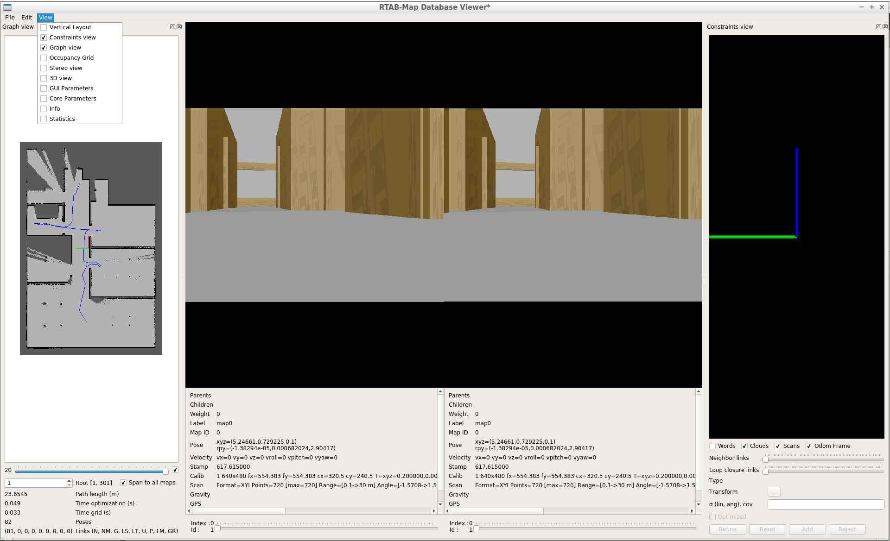
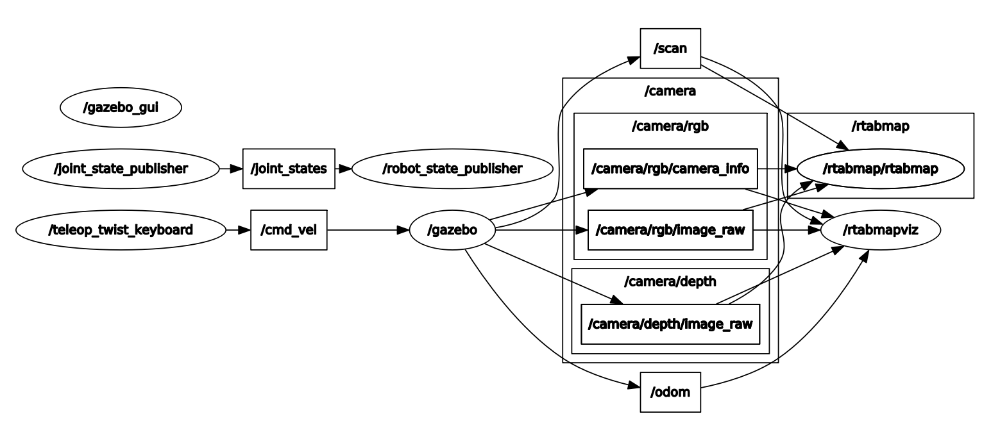
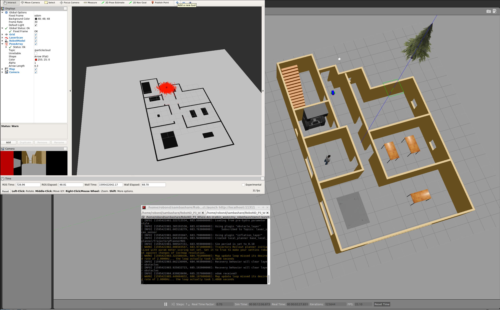
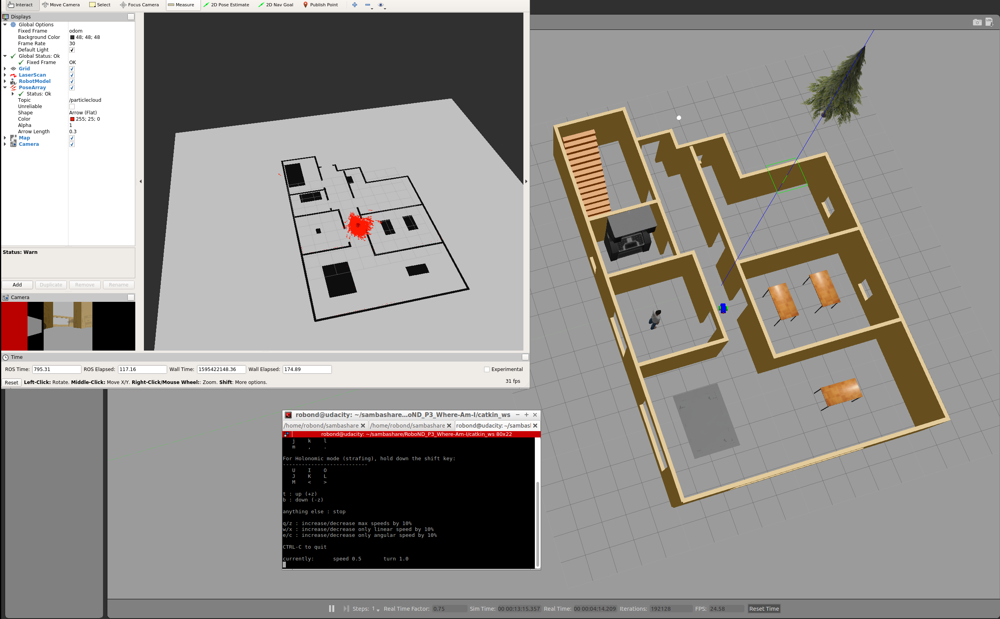

[](https://www.udacity.com/robotics)

# RoboND_P4_Map-My-World
Robotics Software Engineer Project "Map My World"

### Used Packages
[rtabmap_ros](http://wiki.ros.org/rtabmap_ros)

# PROJECT IS IN PROGRESS - DOCUMENTATION IS NOT READY

### Output Video
## Video
[](http://www.youtube.com/watch?v=SGKF_wKkWKs "MPC")

### Steps to launch the simulation

#### Step 1 Update and upgrade the Workspace image
```sh
$ sudo apt-get update
$ sudo apt-get upgrade -y
```

#### Step 2 Install dependencies
```sh
$ sudo apt-get install ros-kinetic-rtabmap-ros
```

#### Step 3 Clone the lab folder in /home/workspace/
```sh
$ cd /home/workspace/
$ git clone https://github.com/tobiassteidle/RoboND_P4_Map-My-World
```

#### Step 3 Compile the code
```sh
$ cd /home/workspace/RoboND_P4_Map-My-World/catkin_ws
$ catkin_make
```

#### Step 4 Source ROS in this workspace
```sh
$ source devel/setup.bash
```

#### Step 5 Run the Simulation (Option 1)
```sh
$ roslaunch my_robot world.launch
$ roslaunch my_robot mapping.launch
$ rosrun teleop_twist_keyboard teleop_twist_keyboard.py
```

After driving around in the environment with stop the ```roslaunch my_robot mapping.launch``` process.  
The `rtabmap.db` will stored.
  
Then run ```rtabmap-databaseViewer ~/.ros/rtabmap.db``` to launch the RAB-Map Database Viewer.  
Under `View` select `Constrints view` and `Graph view`

The result will look like this:



#### Step 5 Run the Simulation (Option 2)  
```sh
$ roslaunch my_robot world.launch
$ roslaunch my_robot localization.launch
$ rosrun teleop_twist_keyboard teleop_twist_keyboard.py
```

### Topic Graph


### Output




