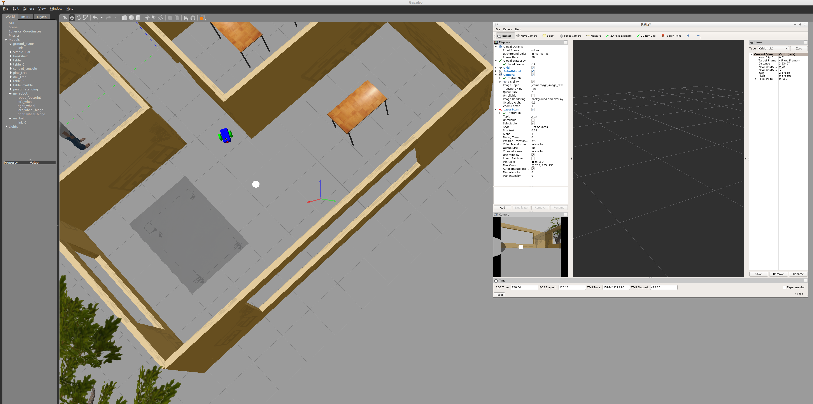

[](https://www.udacity.com/robotics)

# RoboND_P3_Where-Am-I
Robotics Software Engineer Project "Where Am I"

### Steps to launch the simulation

#### Step 1 Update and upgrade the Workspace image
```sh
$ sudo apt-get update
$ sudo apt-get upgrade -y
```

#### Step 2 Install dependencies
```sh
$ sudo apt-get install libignition-math2-dev protobuf-compiler
```

#### Step 3 Clone the lab folder in /home/workspace/
```sh
$ cd /home/workspace/
$ git clone https://github.com/tobiassteidle/RoboND_P3_Where-Am-I
```

#### Step 4 Add aditional Packages
```sh
$ cd /home/workspace/RoboND_P3_Where-Am-I/catkin_ws/src
$ git clone https://github.com/udacity/pgm_map_creator.git
```

#### Step 5 Copy and Modify Worldfile
```sh
$ cd /home/workspace/RoboND_P3_Where-Am-I/catkin_ws/
$ cp src/my_robot/worlds/Flat.world src/pgm_map_creator/world/Flat.world
```

Open the map file using the editor of your choice. Add the following tag towards the end of the file, but just before </world> tag:
```xml
    <plugin filename="libcollision_map_creator.so" name="collision_map_creator"/>
```


#### Step 3 Compile the code
```sh
$ cd /home/workspace/RoboND_P3_Where-Am-I/catkin_ws
$ catkin_make
```

#### Step 4 Source ROS in this workspace
```sh
$ source devel/setup.bash
```

#### Step 5 Run the Simulation  
```sh
$ roslaunch my_robot world.launch
```

### Output

